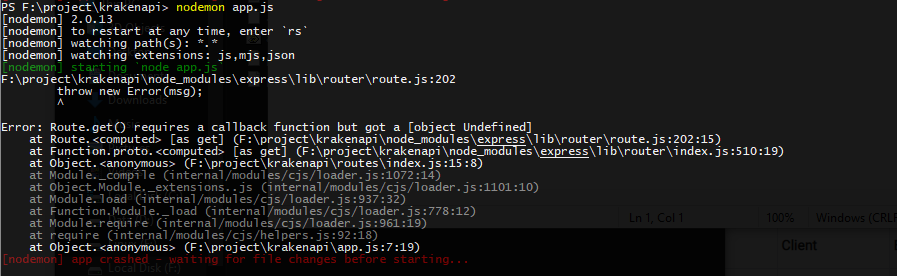

# Membuat RESTful API Dengan Express.js, Sequelize.js dan PostgreSQL
## ketika di running masih error, asumsi ada kode yang kurang

[Sumber Refrensi](https://medium.com/@nico26deo/membuat-restful-api-dengan-express-js-sequelize-js-dan-postgresql-cb14d045cefd)